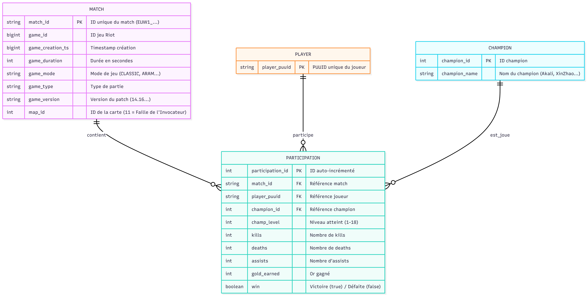
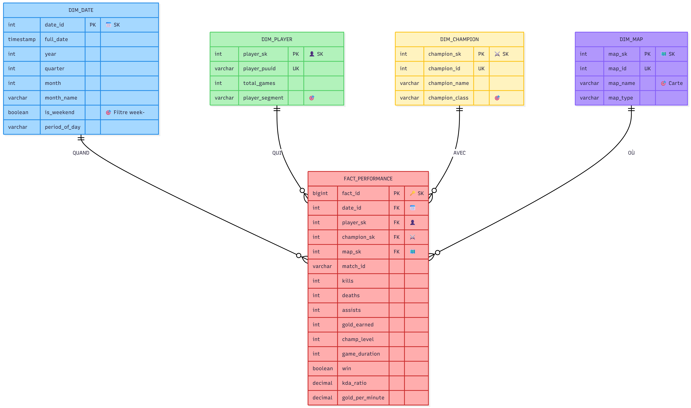
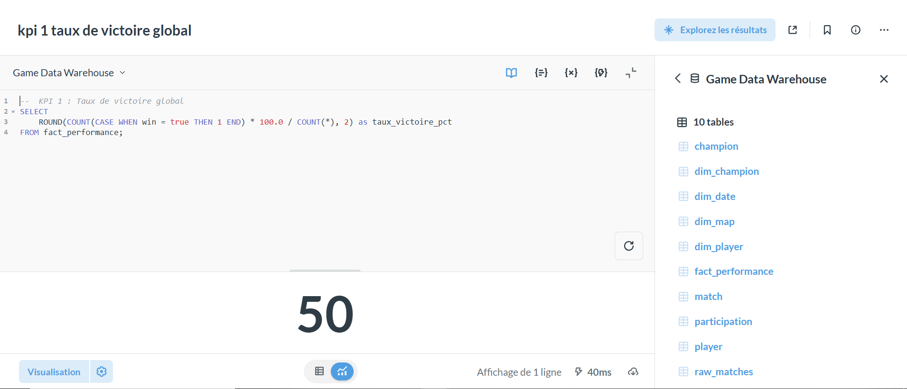
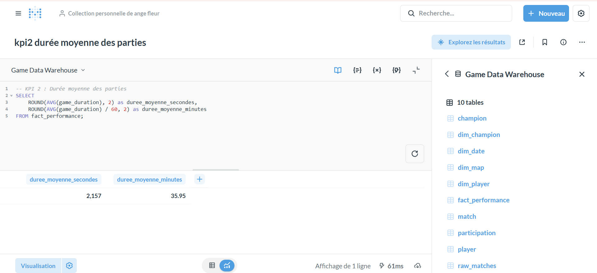
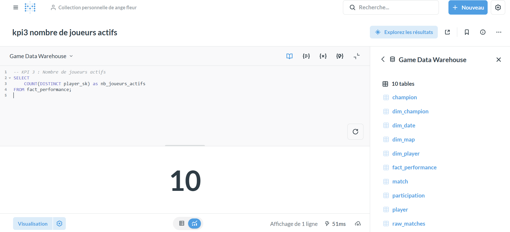
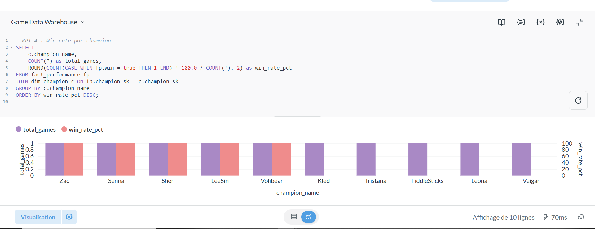
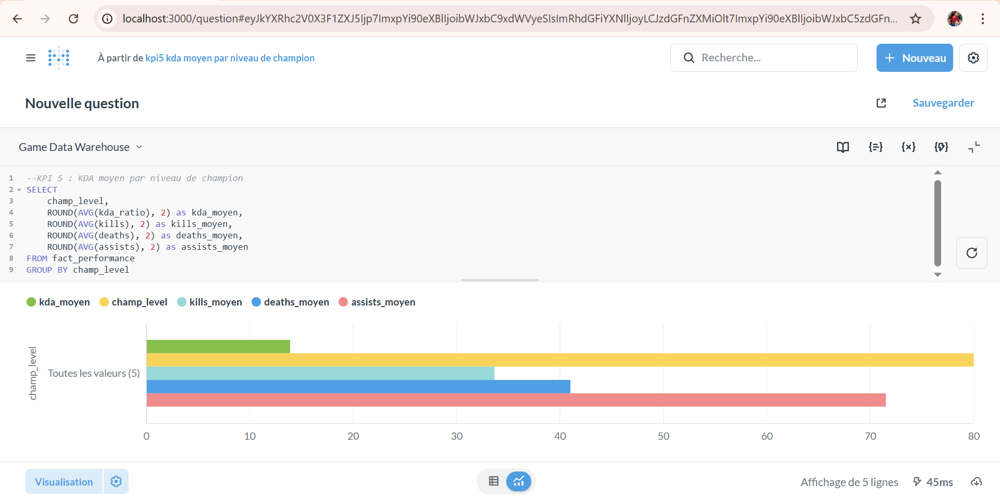
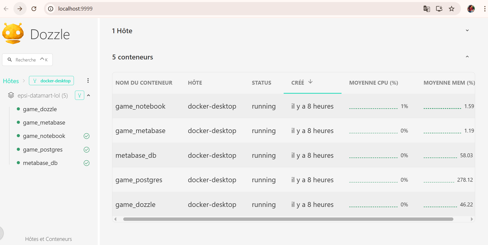
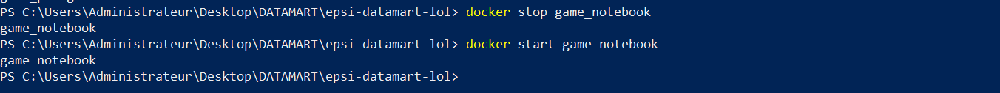
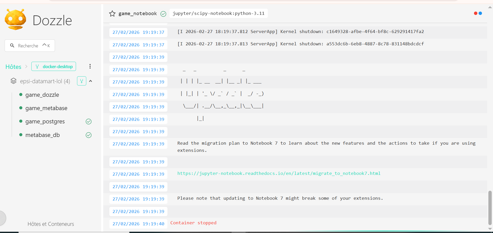

# Atelier 1 - Statistiques de parties

# League of Legends - Analyse de Parties

## Équipe
- Papis C
- Ovina ST-M
- Ange Fleuryse M
- Yohann L

## Jeu de données
**Source** : https://huggingface.co/datasets/AngryBacteria/league_of_legends/tree/main

**Description** : Dataset contenant les statistiques détaillées de matchs League of Legends incluant :
- Informations de match (durée, mode, version)
- Statistiques par joueur (kills, deaths, assists, gold)
- Champions joués
- Résultats des parties (victoire/défaite)

**Caractéristiques** :
- ~50,000+ matchs (fichier 1.5 GB)
- 10 joueurs par match (500,000+ participations)
- 160+ champions uniques
- Format JSON original converti pour analyse

**Note** : Les données originales sont au format JSON (API Riot Games). Conformément aux contraintes de l'atelier, un processus ELT (Extract-Load-Transform) est implémenté pour structurer les données en modèle relationnel.

## Architecture

### Stack technique
| Étape | Technologie | Description |
|-------|-------------|-------------|
| **Extract/Load** | PostgreSQL 15 | Stockage données brutes JSON + modèle relationnel |
| **Transform** | Jupyter Notebook (Python) | pandas, SQLAlchemy, ijson pour traitement 1.5GB |
| **Visualisation** | Jupyter Notebook | matplotlib, seaborn pour analyses et ### Infrastructure
- **Docker Compose** : PostgreSQL + Jupyter Notebook
- **Volume partagé** : Données et notebooks persistés
  
**Ci-dessous le ERD** :



**Tables** :
- `MATCH` : Informations sur les parties
- `PLAYER` : Joueurs uniques
- `CHAMPION` : Champions du jeu
- `PARTICIPATION` : Lien entre matchs, joueurs et champions avec stats

---

## 🚀 Utilisation

### Prérequis
- Docker Desktop
- Git
- Fichier `match_v5.json` placé dans `data/raw/`
- pandas>=2.0.0
- sqlalchemy>=2.0.0
- psycopg2-binary>=2.9.0
- matplotlib>=3.5.0
- seaborn>=0.12.0
- ijson>=3.2.0

### Démarrage

#### 1. Cloner le repo

```bash
git clone https://github.com/TON_USERNAME/epsi-datamart-lol.git
cd epsi-datamart-lol
```

#### 2. Démarrer l'infrastructure
```bash
docker-compose up -d
```
#### 3. Accéder à Jupyter
URL : http://localhost:8888
Token : epsi2024

#### Exécuter dans l'ordre
 1. 01_load_raw.ipynb
 2. 02_transform.ipynb
 3. 03_analysis.ipynb
 4. 04_Player.ipynb

---
# Atelier 2 - Modèle dimensionnel

## Schéma en Étoile


### Tables Dimensionnelles
| Table | Type | Description |
|-------|------|-------------|
| `dim_date` | Dimension | Temps (année, mois, jour, heure, week-end) |
| `dim_player` | Dimension | Joueurs avec segmentation (newbie, casual, regular, hardcore) |
| `dim_champion` | Dimension | Champions avec classe (Tank, Assassin, etc.) |
| `dim_map` | Dimension | Cartes de jeu (Summoners Rift, ARAM, etc.) |
| `fact_performance` | Fait | Mesures : kills, deaths, assists, gold, KDA, win/loss |

## Nouveaux Notebooks
| Notebook | Description |
|----------|-------------|
| `05_dimensional_model.ipynb` | Création du schéma en étoile |
| `06_etl_dimensions.ipynb` | Alimentation des dimensions et faits |
| `07_analyse_dimensionnelle.ipynb` | Analyses complexes (ex: winrate par classe sur carte X le week-end) |

## Exemple de Requête Analytique
```sql
-- Taux de victoire par classe de champion sur Summoners Rift le week-end
SELECT 
    dc.champion_class,
    COUNT(*) as games,
    ROUND(100.0 * SUM(CASE WHEN fp.win THEN 1 ELSE 0 END) / COUNT(*), 2) as winrate_pct
FROM fact_performance fp
JOIN dim_champion dc ON fp.champion_sk = dc.champion_sk
JOIN dim_map dm ON fp.map_sk = dm.map_sk
JOIN dim_date dd ON fp.date_id = dd.date_id
WHERE dm.map_name = 'Summoners Rift'
AND dd.is_weekend = true
GROUP BY dc.champion_class;
```
---
# Atelier 3 - Visualisation

## Étape 1 : Intégration de Metabase
### 1.1 Modification du docker-compose.yml
Ajoutez deux services qui sont metabase et dozzle au fichier docker-compose.yml existant :
 
  ### METABASE 
     metabase:
       image: metabase/metabase:latest
        container_name: game_metabase
        environment:
          - MB_DB_TYPE=postgres
          - MB_DB_DBNAME=metabase
          - MB_DB_PORT=5432
          - MB_DB_USER=metabase
          - MB_DB_PASS=metabase_password
          - MB_DB_HOST=postgres_metabase
        ports:
          - "3000:3000"
        depends_on:
          postgres_metabase:
            condition: service_healthy
        networks:
          - game_network

  ### DOZZLE (Logs)
    dozzle:
      image: amir20/dozzle:latest
      container_name: game_dozzle
      volumes:
        - /var/run/docker.sock:/var/run/docker.sock:ro
      ports:
        - "9999:8080"
      networks:
        - game_network
  

### 1.2 Création de la base Metabase dans PostgreSQL
Créez un script init-metabase.sql :
Se connecter à postgres en tant que superuser

    CREATE DATABASE metabase;
    CREATE USER metabase_user WITH ENCRYPTED PASSWORD 'metabase_pw';
    GRANT ALL PRIVILEGES ON DATABASE metabase TO metabase-_user;

### 1.3 Premier démarrage

#### Démarrer la stack complète

    docker-compose down  # si déjà en cours
    docker-compose up -d

#### Vérifier que Metabase est prêt 
docker logs -f metabase
Accédez à Metabase : http://localhost:3000
##### Configuration initiale :
    Language : Français 
    Email : epsi@local.fr
    Mot de passe : espsi2025
    Database connection : Game DataWarehouse
    Type : PostgreSQL
    Host : postgres 
    Port : 5432
    Database : game_dw 
    Username : game_user
    Password : game_password

## Etape 2: Création de 5indicateurs KPI
Dans Metabase, clique sur "New" 
Sélectionner la base "Game Data Warehouse"

### KPI 1: Taux de victoire global 

    SELECT 
        ROUND(COUNT(CASE WHEN win = true THEN 1 END) * 100.0 / COUNT(*), 2) as taux_victoire_pct
    FROM fact_performance;


### KPI 2: Durée moyenne des parties

    SELECT 
        ROUND(AVG(game_duration), 2) as duree_moyenne_secondes,
        ROUND(AVG(game_duration) / 60, 2) as duree_moyenne_minutes
    FROM fact_performance;


### KPI 3: Nombre de joueurs actifs

    SELECT 
        COUNT(DISTINCT player_sk) as nb_joueurs_actifs
    FROM fact_performance;


### KPI 4: Win rate par champion

    SELECT c.champion_name,
        COUNT(*) as total_games,
        ROUND(COUNT(CASE WHEN fp.win = true THEN 1 END) * 100.0 / COUNT(*), 2) as win_rate_pct
    FROM fact_performance fp
    JOIN dim_champion c ON fp.champion_sk = c.champion_sk
    GROUP BY c.champion_name
    ORDER BY win_rate_pct DESC;


### KPI 5 : KDA moyen par niveau de champion
    SELECT champ_level,
        ROUND(AVG(kda_ratio), 2) as kda_moyen,
        ROUND(AVG(kills), 2) as kills_moyen,
        ROUND(AVG(deaths), 2) as deaths_moyen,
        ROUND(AVG(assists), 2) as assists_moyen
    FROM fact_performance
    GROUP BY champ_level
    ORDER BY champ_level;


## Etape 3 :  Centralisation des logs

###  Service Dozzle
- **URL** : http://localhost:9999
- **Fonction** : Visualisation centralisée des logs de tous les conteneurs

### Visualisations :


### Architecture
Tous les conteneurs envoient automatiquement leurs logs stdout/stderr à Dozzle via le montage du Docker socket.

### Exemple d'erreur documentée
**Scénario** : Arrêt du service PostgreSQL


**Impact** : Les services Metabase et Notebook perdent la connexion à la base de données

Log observé dans Dozzle :

    ERROR: connection to server at "postgres", port 5432 failed: Connection refused
    Is the server running on that host and accepting TCP/IP connections?

### Visualisation de l'erreur du Dozzle


Résolution : Redémarrage du conteneur PostgreSQL

    docker start game_postgres
